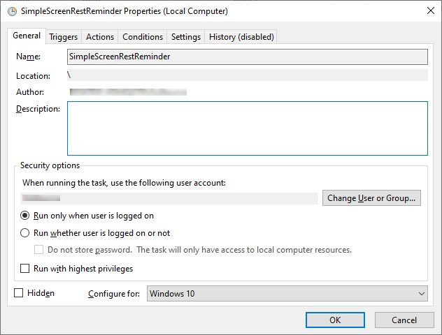
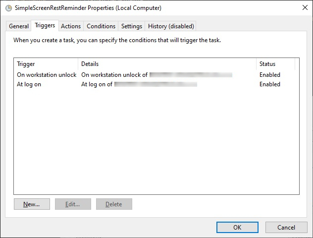
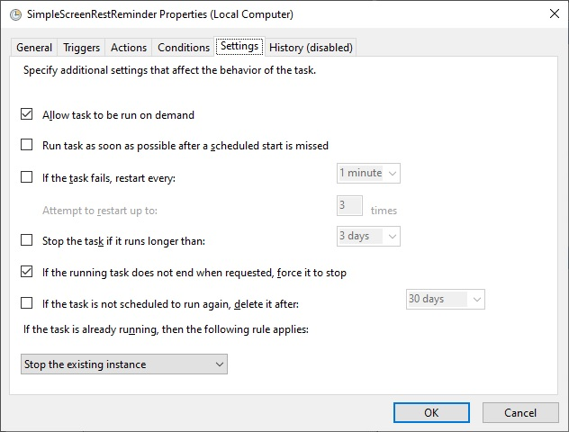

# SimpleScreenRestReminder :eyeglasses:
This repository consists of a single script, whose purpose is to remind you to rest your eyes during long sessions on a Windows computer.

# What is the 20-20-20 rule
If you spend a lot of time on your computer screen, you have to take care about eye strain. 
As it's very complicated to think about looking away when you are focused on your work, this script is made to remind you to follow the 20-20-20 rule. 
This rule consists in taking an ocular break during 20 seconds, by looking in 20 feets, every 20 minutes of screen work.

# Installation
* ## Allow local script to run
    1. Run the Windows Powershell Terminal as administrator.
    2. Set PowerShell Execution Policy to unrestricted by typing `$ Set-ExecutionPolicy Unrestricted` to allow local unverified Powershell scripts to run.
  

* ## Schedule SimpleScreenRestReminder execution
    1. Run the Windows Task Scheduler and select **Create Task...** in the **Actions** section.
    2. In the **General** tab, name the task as you want (ie. SimpleScreenRestReminder) and configure the task for your Windows (ie. Windows 10). 
    
    3. In the **Triggers** tab, add a new triggers at log on and workstation unlock. 
    
    4. In the **Actions** tab, create an action to run the script by typing `powershell.exe` in **Program/script** textbox and `-windowstyle hidden <your_script_path>\SimpleScreenRestReminder.ps1` in the **Add arguments (optional)** textbox. 
    The `-windowstyle hidden` argument allows you to hide the Powershell terminal instance.
    5. In the **Settings** tab, disable the **Stop the task if it runs longer than** and select **Stop the existing instance**. 
    This option allows to run single instance of the script and to reset timer after unlock / log off and sleep mode. 
    
